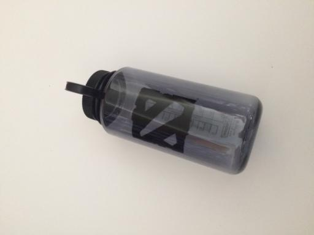
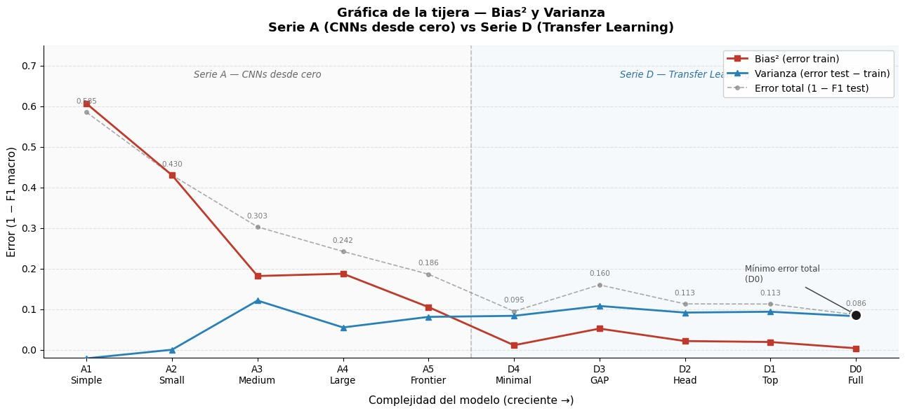

# Clasificación Automática de Residuos mediante Deep Learning

**Asignatura:** Aprendizaje Profundo

**Autores:** Carlos Gómez Sáez y Ada Nuévalos Gadea

---

Este repositorio contiene el proyecto final de la asignatura de Aprendizaje Profundo. El objetivo principal es desarrollar un sistema automatizado capaz de clasificar residuos en diferentes categorías (vidrio, papel, cartón, plástico, metal, etc.) utilizando técnicas de Visión por Computador y Deep Learning. Este proyecto busca mejorar la eficiencia en las plantas de reciclaje y promover la sostenibilidad ambiental.


## 1. Definición del Problema y Datos

### El Problema

La correcta separación de residuos es un cuello de botella crítico en el proceso de reciclaje. La clasificación manual es lenta, costosa y propensa a errores. Este proyecto aborda este problema como una tarea de **Clasificación de Imágenes Multiclase (Supervisada)**.

### El Dataset

Para este proyecto, utilizamos el dataset estándar de referencia en la literatura académica: **TrashNet** (y sus variantes extendidas).

- **Origen:** Recopilado por Gary Thung y Mindy Yang (Stanford University).
- **Contenido:** 2.527 imágenes en total.
- **Clases (6 categorías):**
  1.  Vidrio (Glass) - 501 imágenes
  2.  Papel (Paper) - 594 imágenes
  3.  Cartón (Cardboard) - 403 imágenes
  4.  Plástico (Plastic) - 482 imágenes
  5.  Metal (Metal) - 410 imágenes
  6.  Basura general (Trash) - 137 imágenes

### Dimensiones de los Datos

| Propiedad               | Valor                                  |
| :---------------------- | :------------------------------------- |
| Imágenes totales        | 2.527                                  |
| Resolución original     | 512 x 384 px                           |
| Resolución preprocesada | 224 x 224 px                           |
| Canales de color        | 3 (RGB)                                |
| Tipo de dato (X)        | `float32`, normalizado [0, 1]          |
| Shape de X              | `(2527, 224, 224, 3)`                  |
| Shape de y              | `(2527,)` — enteros codificados [0..5] |
| Ratio de desbalanceo    | 4.34:1 (paper: 594 vs trash: 137)      |

### Muestras del Dataset

A continuación se muestran ejemplos representativos de cada una de las 6 categorías:

[TrashNet Dataset en Kaggle](https://www.kaggle.com/datasets/feyzazkefe/trashnet)

<table align="center">
  <tr>
    <td align="center">
      <br>
      <b>Metal</b>
    </td>
    <td align="center">
      <br>
      <b>Cardboard</b>
    </td>
    <td align="center">
      <br>
      <b>Paper</b>
    </td>
  </tr>
  <tr>
    <td align="center">
      <br>
      <b>Plastic</b>
    </td>
    <td align="center">
      <br>
      <b>Trash</b>
    </td>
    <td align="center">
      <br>
      <b>Glass</b>
    </td>
  </tr>
</table>

## 2. Estado del Arte (SOTA)

La clasificación de residuos basada en imágenes ha evolucionado desde métodos clásicos de Machine Learning hasta arquitecturas complejas de Deep Learning.

### Evolución de las técnicas

1.  **Enfoques Clásicos (Machine Learning):** Los trabajos pioneros utilizaron extracción de características manuales (SIFT, HOG) junto con clasificadores como _Support Vector Machines_ (SVM). Estos métodos demostraron ser robustos pero limitados en su capacidad de generalización frente a variaciones de fondo e iluminación, alcanzando precisiones en torno al 63% [1].

2.  **Redes Convolucionales (CNNs) desde cero:** La implementación de CNNs simples (tipo AlexNet) entrenadas desde cero sobre este dataset pequeño (~2.500 imágenes) suele sufrir de _overfitting_, obteniendo resultados modestos si no se ajustan correctamente los hiperparámetros y no se aplican técnicas de regularización [3].

3.  **Transfer Learning y Modelos Pre-entrenados:** La literatura actual coincide en que el uso de _Transfer Learning_ es la estrategia dominante. Modelos pre-entrenados en ImageNet como ResNet50, VGG16, MobileNet y DenseNet han elevado la precisión por encima del 90%.
    - **Mao et al.** [6] demostraron que optimizar las capas densas mediante Algoritmos Genéticos (GA) junto con _Data Augmentation_ agresivo puede llevar la precisión al 99.6% con DenseNet121.
    - **White et al.** [3] propusieron _WasteNet_, optimizando DenseNet para dispositivos _edge_ (como Jetson Nano), logrando un 97%.
    - **Alkılınç et al.** [9] exploraron técnicas de _Ensemble Learning_, combinando las predicciones de ConvNeXt, ResNet y DenseNet para mejorar la robustez, alcanzando un 96% con medias ponderadas.

4.  **Tendencias actuales (2024-2025):** Los trabajos más recientes se centran en mecanismos de atención (como CE-EfficientNetV2 de Qiu et al. [4]) y arquitecturas ligeras para implementación en tiempo real.

### Tabla Comparativa de Modelos (Benchmark en TrashNet)

La siguiente tabla resume los resultados reportados en la literatura científica analizada para este problema sobre el dataset TrashNet (o variantes aumentadas del mismo):

| Modelo                           | Dataset  | Accuracy | Precision | Recall | F1-Score | Referencia           |
| :------------------------------- | :------- | :------- | :-------- | :----- | :------- | :------------------- |
| _WasteNet_ (DenseNet modificado) | TrashNet | _97.0%_  | 97.0%     | 97.0%  | 97.0%    | White et al. [3]     |
| _GoogleNet + SVM_                | TrashNet | _97.86%_ | -         | -      | -        | Özkaya & Seyfi [2]   |
| _Ensemble (Weighted Avg)_        | TrashNet | 96.0%    | 94.0%     | 97.0%  | 95.0%    | Alkılınç et al. [9]  |
| _CE-EfficientNetV2_              | TrashNet | 96.5%    | -         | -      | -        | Qiu et al. [4]       |
| _MobileNetV2_                    | TrashNet | 95.17%   | -         | -      | -        | Buchade & Bhoite [5] |
| _DenseNet169_                    | TrashNet | 95.3%    | 95.4%     | 95.3%  | 95.3%    | White et al. [3]     |
| _ResNet50_                       | TrashNet | 93.7%    | 93.7%     | 93.7%  | 93.7%    | White et al. [3]     |
| _VGG16_                          | TrashNet | 92.8%    | 92.7%     | 92.8%  | 92.7%    | White et al. [3]     |
| _AlexNet_                        | TrashNet | 78.4%    | 78.6%     | 78.4%  | 78.2%    | White et al. [3]     |
| _SVM + SIFT_ (Baseline)          | TrashNet | 63.0%    | 59.0%     | 60.0%  | -        | Thung & Yang [1]     |

> **Nota:** Las precisiones superiores al 95% en la literatura generalmente involucran técnicas intensivas de _Data Augmentation_ para multiplicar artificialmente el tamaño del dataset original. Los campos marcados con "-" indican que la métrica no fue reportada explícitamente en el estudio correspondiente.

## 3. Métricas de Evaluación

### Objetivo Matemático

Este proyecto se formula como un problema de **clasificación multiclase supervisada**: dada una imagen de entrada, el modelo debe asignarla a una de las 6 categorías de residuos. Para resolver este problema de forma óptima, se distinguen tres niveles:

1.  **Objetivo de clasificación:** Aprender una función $f: \mathbb{R}^{224 \times 224 \times 3} \rightarrow \{0, 1, ..., 5\}$ que minimice el error de generalización.

2.  **Función de coste para optimizar:** Se emplea la **Entropía Cruzada Categórica** (_Categorical Cross-Entropy_) como función de pérdida durante el entrenamiento:

$$\mathcal{L} = -\frac{1}{N}\sum_{i=1}^{N}\sum_{c=1}^{C} y_{i,c} \log(\hat{y}_{i,c})$$

donde $N$ es el número de muestras, $C = 6$ es el número de clases, $y_{i,c}$ es la etiqueta real (one-hot) y $\hat{y}_{i,c}$ es la probabilidad predicha por el modelo para la clase $c$. Esta función penaliza más las predicciones que se alejan de la clase correcta y es diferenciable, permitiendo la optimización por descenso de gradiente.

3.  **Métricas de progreso para evaluar la calidad del modelo:**

- **Accuracy (Exactitud):** Porcentaje global de predicciones correctas. Útil como indicador general pero insuficiente cuando hay desbalanceo entre clases.

$$\text{Accuracy} = \frac{\text{Predicciones correctas}}{\text{Total de muestras}}$$

- **Precision:** Proporción de predicciones positivas que son realmente correctas. Responde a la pregunta: _de todo lo que el modelo predijo como clase $c$, cuánto acertó realmente._

$$\text{Precision}_c = \frac{TP_c}{TP_c + FP_c}$$

- **Recall (Sensibilidad):** Proporción de muestras reales de una clase que el modelo detecta correctamente. Responde a: _de todas las muestras que realmente son clase $c$, cuántas detectó._

$$\text{Recall}_c = \frac{TP_c}{TP_c + FN_c}$$

- **F1-Score (Macro):** Media armónica de Precision y Recall, promediada sobre todas las clases sin ponderar por frecuencia. Crucial en este proyecto dado el desbalanceo (ratio 4.34:1), ya que pondera por igual cada clase.

$$F1_c = 2 \cdot \frac{\text{Precision}_c \cdot \text{Recall}_c}{\text{Precision}_c + \text{Recall}_c} \qquad \Rightarrow \qquad F1_{\text{macro}} = \frac{1}{C}\sum_{c=1}^{C} F1_c$$

- **Confusion Matrix:** Representación visual que muestra dónde se concentran los errores del modelo (ej. confundir plástico con vidrio), permitiendo diagnosticar debilidades por clase.

## 4. Resultados Experimentales

### Tabla Comparativa de Modelos


<table>
  <thead>
    <tr>
      <th rowspan="2">Modelo</th>
      <th rowspan="2">Nº Parámetros</th>
      <th colspan="3">Accuracy</th>
      <th colspan="3">Precision (Macro)</th>
      <th colspan="3">Recall (Macro)</th>
      <th colspan="3">F1 (Macro)</th>
    </tr>
    <tr>
      <th>Train</th><th>Val</th><th>Test</th>
      <th>Train</th><th>Val</th><th>Test</th>
      <th>Train</th><th>Val</th><th>Test</th>
      <th>Train</th><th>Val</th><th>Test</th>
    </tr>
  </thead>
  <tbody>
    <tr>
      <td><b>Regresión Logística</b></td>
      <td>7,782</td>
      <td>0.9955</td><td>0.5013</td><td>0.6000</td>
      <td>0.9946</td><td>0.5000</td><td>0.5864</td>
      <td>0.9965</td><td>0.5065</td><td>0.5802</td>
      <td>0.9955</td><td>0.5023</td><td>0.5815</td>
    </tr>
    <tr>
      <td><b>SVM</b></td>
      <td>2,182,851</td>
      <td>0.9972</td><td>0.6491</td><td>0.7184</td>
      <td>0.9975</td><td>0.6639</td><td>0.7455</td>
      <td>0.9975</td><td>0.6209</td><td>0.6856</td>
      <td>0.9975</td><td>0.6347</td><td>0.7035</td>
    </tr>
    <tr>
      <td><b>A1 — CNN Simple</b></td>
      <td>210</td>
      <td>0.4717</td><td>0.4802</td><td>0.4921</td>
      <td>0.4138</td><td>0.4406</td><td>0.4257</td>
      <td>0.4100</td><td>0.4138</td><td>0.4326</td>
      <td>0.3937</td><td>0.4030</td><td>0.4150</td>
    </tr>
    <tr>
      <td><b>A2 — CNN Small</b></td>
      <td>1,094</td>
      <td>0.6400</td><td>0.6200</td><td>0.6100</td>
      <td>0.6300</td><td>0.6500</td><td>0.6600</td>
      <td>0.5700</td><td>0.5500</td><td>0.5600</td>
      <td>0.5700</td><td>0.5600</td><td>0.5700</td>
    </tr>
    <tr>
      <td><b>A3 — CNN Medium</b></td>
      <td>19,782</td>
      <td>0.8360</td><td>0.7414</td><td>0.7263</td>
      <td>0.8268</td><td>0.7149</td><td>0.7114</td>
      <td>0.8121</td><td>0.6954</td><td>0.6884</td>
      <td>0.8184</td><td>0.7010</td><td>0.6973</td>
    </tr>
    <tr>
      <td><b>A4 — CNN Large</b></td>
      <td>94,918</td>
      <td>0.8343</td><td>0.7546</td><td>0.7816</td>
      <td>0.8146</td><td>0.7480</td><td>0.7643</td>
      <td>0.8346</td><td>0.7558</td><td>0.7741</td>
      <td>0.8127</td><td>0.7301</td><td>0.7578</td>
    </tr>
    <tr>
      <td><b>A5 — CNN Frontier</b></td>
      <td>424,006</td>
      <td>0.9021</td><td>0.8100</td><td>0.8395</td>
      <td>0.8971</td><td>0.7944</td><td>0.8354</td>
      <td>0.8966</td><td>0.7964</td><td>0.8081</td>
      <td>0.8949</td><td>0.7917</td><td>0.8140</td>
    </tr>
    <tr>
      <td><b>D0 — EffNet Full</b></td>
      <td>6,253,910</td>
      <td>0.9960</td><td>0.9314</td><td>0.9316</td>
      <td>0.9961</td><td>0.9280</td><td>0.9199</td>
      <td>0.9968</td><td>0.9300</td><td>0.9121</td>
      <td>0.9964</td><td>0.9253</td><td>0.9139</td>
    </tr>
    <tr>
      <td><b>D1 — EffNet Top</b></td>
      <td>6,248,790</td>
      <td>0.9864</td><td>0.9050</td><td>0.9132</td>
      <td>0.9747</td><td>0.8882</td><td>0.8815</td>
      <td>0.9886</td><td>0.9069</td><td>0.9026</td>
      <td>0.9810</td><td>0.8895</td><td>0.8874</td>
    </tr>
    <tr>
      <td><b>D2 — EffNet Head</b></td>
      <td>6,084,054</td>
      <td>0.9853</td><td>0.9077</td><td>0.9079</td>
      <td>0.9713</td><td>0.8889</td><td>0.8797</td>
      <td>0.9877</td><td>0.9107</td><td>0.9040</td>
      <td>0.9786</td><td>0.8950</td><td>0.8871</td>
    </tr>
    <tr>
      <td><b>D3 — EffNet GAP</b></td>
      <td>5,927,040</td>
      <td>0.9757</td><td>0.9024</td><td>0.9132</td>
      <td>0.9738</td><td>0.8896</td><td>0.8861</td>
      <td>0.9342</td><td>0.8421</td><td>0.8344</td>
      <td>0.9480</td><td>0.8526</td><td>0.8402</td>
    </tr>
    <tr>
      <td><b>D4 — EffNet Minimal</b></td>
      <td>5,926,998</td>
      <td>0.9989</td><td>0.9235</td><td>0.9395</td>
      <td>0.9989</td><td>0.9147</td><td>0.9297</td>
      <td>0.9990</td><td>0.9153</td><td>0.9288</td>
      <td>0.9990</td><td>0.9140</td><td><b>0.9291</b></td>
    </tr>
  </tbody>
</table>

----

## **Gráfica de la tijera — Bias² y Varianza**


Realizamos esta gráfica con el objetivo de visualizar el trade-off bias-varianza a lo largo de todas las arquitecturas probadas, ordenadas por complejidad creciente. Comparamos dos series: la Serie A con CNNs entrenadas desde cero (de A1-Simple a A5-Frontier) y la Serie D con EfficientNet usando transfer learning (de D4-Minimal a D0-Full).

Para construirla calculamos tres métricas a partir del F1 macro de cada modelo. El **Bias²** como `1 − F1_train`, que refleja cuánto le cuesta al modelo aprender los propios datos de entrenamiento. La **Varianza** como `F1_train − F1_test`, que mide cuánto empeora el modelo al enfrentarse a datos no vistos. Y el **Error total** como `1 − F1_test`, que representa el rendimiento real del modelo. Elegimos F1 macro en lugar del loss porque al tener 6 clases potencialmente desbalanceadas, esta métrica pondera igual todas las clases y es más representativa del rendimiento real.

La forma de tijera es clara en la Serie A: el bias² domina en los modelos simples y decrece al aumentar la complejidad, mientras que la varianza crece progresivamente indicando overfitting. La Serie D rompe completamente este patrón gracias al preentrenamiento en ImageNet, logrando bias² y varianza bajos de forma simultánea en todos sus modelos.

Como modelo definitivo elegimos **D4-Minimal**. Es importante destacar que, en todos los modelos de la Serie D, **se ha aplicado un _full fine-tuning_** (el backbone completo se ha descongelado utilizando un *learning rate* muy bajo para preservar los pesos base). La gran efectividad y eficiencia estructural de D4 radica de forma exclusiva en su cabeza de clasificación podada al mínimo (se han eliminado todas las capas ocultas densas y el clasificador actúa directamente tras el Dropout). Pese a la extrema simplicidad de su salida, este modelo no solo iguala sino que **supera** al modelo de máxima complejidad de la serie (D0-Full), reduciendo el error total a apenas 0.071 (frente al 0.086 de D0). Esto demuestra que el extractor original de ImageNet es tan eficiente que sobrecargar la cabeza predictiva con capas densas adicionales (D0 o D1) resulta contraproducente y limita la capacidad de generalización. D4 se consolida como el mejor modelo indiscutible de todo el experimento en términos absolutos y de coste computacional, presentando métricas excepcionales: F1-macro de 0.929, precisión de 0.930 y recall de 0.929 en test.

| Modelo | Nº Parámetros | Split | Accuracy | Precision (Macro) | Recall (Macro) | F1 (Macro) |
| :---------------------- | ------------: | :---- | -------: | ----------------: | -------------: | ---------: |
| **D4 — EffNet Minimal** | 5,926,998 | Train | 0.9989 | 0.9989 | 0.9990 | 0.9990 |
| | | Val | 0.9235 | 0.9147 | 0.9153 | 0.9140 |
| | | Test | 0.9395 | 0.9297 | 0.9288 | **0.9291** |
---

## 5. Estructura del Proyecto

El repositorio está organizado de la siguiente manera:

```text
Garbage-Classification/
│
├── data/                             # Dataset del proyecto
│   ├── raw/                          # Imágenes originales del TrashNet organizadas por clase
│   │   ├── cardboard/                #   403 imágenes de cartón
│   │   ├── glass/                    #   501 imágenes de vidrio
│   │   ├── metal/                    #   410 imágenes de metal
│   │   ├── paper/                    #   594 imágenes de papel
│   │   ├── plastic/                  #   482 imágenes de plástico
│   │   └── trash/                    #   137 imágenes de basura general
│   └── processed/
│       └── trashnet_224x224.npz      # Dataset preprocesado (224×224 px, float32 normalizado)
│
├── notebooks/                        # Notebooks de experimentación progresiva
│   ├── 1_EDA_Garbage_Classification.ipynb          # Análisis exploratorio del dataset
│   ├── 2.1.Modelo_Lineal_Garbage_Classification.ipynb  # Baseline con Regresión Logística + HOG
│   ├── 2.2.Modelo_ML_Garbage_Classification.ipynb  # Clasificador SVM + HOG
│   ├── 2.3.Modelo_Red_Neuronal_Simple.ipynb        # Red neuronal densa simple (A1)
│   ├── 3.Modelo_Red_Neuronal_Simple.ipynb          # Pruebas adicionales de arquitectura simple
│   ├── 3.Modelo_D0.ipynb                           # Fase 1 y 2 en modelo D0 (EffNet Full)
│   ├── 3.Modelo_D1.ipynb                           # Fase 1 y 2 en modelo D1 (EffNet Top)
│   ├── 3.Modelo_D2.ipynb                           # Fase 1 y 2 en modelo D2 (EffNet Head)
│   ├── 3.Modelo_D3.ipynb                           # Fase 1 y 2 en modelo D3 (EffNet GAP)
│   └── 3.Modelo_D4.ipynb                           # Fase 1 y 2 en modelo D4 (Modelo final)
│   *(Nota: Los modelos iterativos de la serie A fueron documentados en notebooks análogos)*
│
├── models/                           # Definición de arquitecturas como módulos Python reutilizables
│   ├── A1_simple_cnn.py             # Red neuronal densa simple
│   ├── A2_cnn_small.py              # CNN pequeña con pocas capas convolucionales
│   ├── A3_cnn_medium.py             # CNN mediana con regularización
│   ├── A4_cnn_large.py              # CNN grande con BatchNorm y Dropout
│   ├── A5_D5_cnn_frontier.py        # CNN frontera (mayor capacidad entrenada desde cero)
│   ├── D0_effnet_full.py            # EfficientNetV2B0 — fine-tuning total con cabeza compleja
│   ├── D1_effnet_top.py             # EfficientNetV2B0 — fine-tuning total con Dense(256)
│   ├── D2_effnet_head.py            # EfficientNetV2B0 — fine-tuning total con Dense(128)
│   ├── D3_effnet_gap.py             # EfficientNetV2B0 — fine-tuning total con Dense(6 artificial)
│   └── D4_effnet_minimal.py         # EfficientNetV2B0 — fine-tuning total con clasificador lineal puro
│
├── src/                             # Código fuente modular compartido entre notebooks
│   ├── __init__.py
│   └── utils.py                     # Funciones auxiliares: carga de datos, split, callbacks, visualización
│
├── code_example/                    # Notebooks de referencia de otros proyectos (SOTA externo)
│   ├── garbage-classification-cnn.ipynb                   # Ejemplo CNN con Keras/TensorFlow
│   ├── garbage-classification.ipynb                       # Ejemplo clasificación básica
│   └── pytorch-garbage-classification-95-accuracy.ipynb   # Ejemplo con PyTorch (95% accuracy)
│
├── sota_references/                 # Papers y documentación del estado del arte consultada
│   └── README.md                    # Índice y resumen de los artículos de referencia
│
├── reports/                         # Figuras, gráficas e informes generados durante el proyecto
├── requirements.txt                 # Dependencias Python del proyecto
└── README.md                        # Documentación general del proyecto
```

## 6. Referencias

Se presentan las referencias utilizadas, cada una acompañada de una frase que sintetiza su contribución al campo.

[1] G. Thung y M. Yang, _"Classification of Trash for Recyclability Status,"_ CS 229 Project Report, Stanford University, 2016.

- Trabajo fundacional que creó el dataset TrashNet (2.527 imágenes, 6 clases) y estableció la primera línea base con SVM + SIFT, alcanzando un 63% de accuracy.

[2] U. Özkaya y L. Seyfi, _"Fine-Tuning Models Comparisons on Garbage Classification for Recyclability,"_ arXiv:1908.04393, 2019.

- Comparación de arquitecturas preentrenadas (AlexNet, VGG16, GoogleNet, ResNet) combinadas con clasificadores Softmax y SVM, logrando el mejor resultado con GoogleNet + SVM (97.86%).

[3] G. White, C. Cabrera, A. Palade, F. Li y S. Clarke, _"WasteNet: Waste Classification at the Edge for Smart Bins,"_ arXiv:2006.05873, 2020.

- Propone WasteNet, una variante de DenseNet optimizada para despliegue en dispositivos edge (Jetson Nano), alcanzando 97% con DenseNet modificado y evaluando múltiples arquitecturas sobre TrashNet.

[4] W. Qiu, C. Xie y J. Huang, _"An Improved EfficientNetV2 for Garbage Classification,"_ arXiv:2503.21208, 2025.

- Introduce un módulo de atención Channel-Efficient (CE-Attention) sobre EfficientNetV2 para mejorar la extracción de características sin escalar dimensiones, logrando 96.5% de accuracy.

[5] S. J. Buchade y S. Bhoite, _"Comparative Study of ML Algorithms for Garbage Classification,"_ Research Square (Preprint), DOI: 10.21203/rs.3.rs-3903806/v1, 2024.

- Estudio comparativo de MobileNetV2, InceptionV3 y ResNet aplicados a la clasificación de residuos, con MobileNetV2 como modelo más eficiente (95.17%).

[6] W.-L. Mao, W.-C. Chen, C.-T. Wang y Y.-H. Lin, _"Recycling Waste Classification Using Optimized Convolutional Neural Network,"_ Resources, Conservation and Recycling, vol. 164, 105132, 2021.

- Propone una CNN optimizada mediante algoritmos evolutivos para clasificación de residuos reciclables, abordando la optimización mediante técnicas de hiperparámetros automáticos.

[7] R. Shukurov, _"Garbage Classification Based on Fine-Tuned State-of-the-Art Models,"_ 9th International Conference on Control, Decision and Information Technologies (CoDIT), IEEE, pp. 1-6, 2023.

- Evalúa modelos fine-tuned del estado del arte sobre múltiples datasets de residuos, analizando la transferibilidad de características entre dominios.

[8] K. Rathod, C. Vyas, K. Makvana, K. Kandoriya y A. Nimavat, _"Garbage Classification Based on Dense Network (GCDN) Using Transfer Learning and Modified Hyper Parameter,"_ International Journal of Intelligent Systems and Applications in Engineering, vol. 12, no. 4, 2024.

- Propone un enfoque basado en DenseNet201 con transfer learning y ajuste fino de hiperparámetros para mejorar la clasificación de basura, focalizándose en la reutilización de características densas.

[9] A. Alkılınç, F. Yıldırım Okay, İ. Kök y S. Özdemir, _"Deep Ensemble Learning Model for Waste Classification Systems,"_ Sustainability, vol. 18, no. 24, 2026.

- Diseña un sistema de ensemble profundo combinando múltiples CNNs mediante promediado ponderado, logrando 96% de accuracy con mayor robustez que los modelos individuales.

[10] M. Nahiduzzaman, M. F. Ahamed, M. Naznine, M. J. Karim et al., _"An Automated Waste Classification System Using Deep Learning Techniques,"_ Knowledge-Based Systems, vol. 313, 112840, 2025.

- Sistema automatizado que aplica técnicas profundas para clasificación de residuos a gran escala, enfocado en la sostenibilidad ambiental y la eficiencia del reciclaje con aplicaciones en entornos industriales.